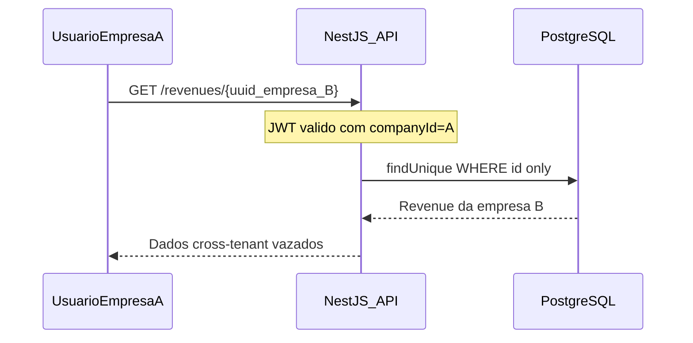
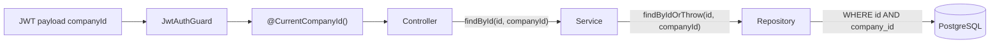
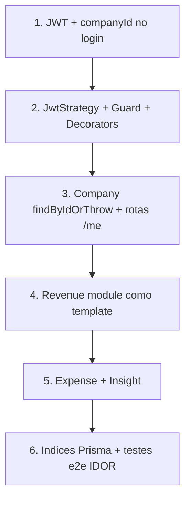

# Plano S-01 — Trava de Segurança Multi-Tenant (Anti-IDOR)

## Contexto da vulnerabilidade

O relatório [docs/audit/report-v1.md](docs/audit/report-v1.md) (item **S-01**) identifica que a documentação exige filtro por `company_id`, mas **não define o mecanismo de ownership por recurso**. O risco concreto:



**Estado atual do backend** ([fynora-backend/src/](fynora-backend/src/)):

- JWT em [auth.service.ts](fynora-backend/src/auth/auth.service.ts) carrega apenas `sub` + `email` — **sem `companyId`**
- Não existem `JwtAuthGuard`, `@CurrentCompanyId()`, nem Passport
- Repositories ([company.repository.ts](fynora-backend/src/company/company.repository.ts), [user.repository.ts](fynora-backend/src/user/user.repository.ts)) não possuem queries escopadas por tenant
- Módulos `revenue`, `expense`, `insight` existem no [schema.prisma](fynora-backend/prisma/schema.prisma) mas **ainda não têm código NestJS**
- Stubs comentados em [company.service.ts](fynora-backend/src/company/company.service.ts) já antecipam `tenantCompanyId` — bom alinhamento com o padrão desejado

---

## Princípio arquitetural (regra de ouro)



| Camada | Responsabilidade | Proibido |
|--------|------------------|----------|
| **Controller** | Extrair `companyId` do JWT via decorator; passar ao service | Ler `company_id` do body/query |
| **Service** | Receber `companyId` como parâmetro explícito em todo método tenant-scoped | Query direta ao Prisma |
| **Repository** | Aplicar `company_id` em **toda** query (`find`, `update`, `delete`) | `findUnique({ where: { id } })` isolado |
| **DTO** | Validar campos de negócio | Aceitar `company_id` no input |

**Resposta a IDOR:** quando o recurso não pertence ao tenant (ou não existe), retornar **HTTP 404** com `RESOURCE_NOT_FOUND` — nunca 403, para não revelar existência de UUIDs de outros tenants.

---

## Fase 1 — Infraestrutura de contexto tenant (arquivos novos)

### Dependências a adicionar em [package.json](fynora-backend/package.json)

- `@nestjs/passport`, `passport`, `passport-jwt`, `@types/passport-jwt`

### Arquivos a criar

| Arquivo | Propósito |
|---------|-----------|
| [src/auth/interfaces/jwt-payload.interface.ts](fynora-backend/src/auth/interfaces/jwt-payload.interface.ts) | Contrato do payload |
| [src/auth/strategies/jwt.strategy.ts](fynora-backend/src/auth/strategies/jwt.strategy.ts) | Valida token e popula `request.user` |
| [src/auth/guards/jwt-auth.guard.ts](fynora-backend/src/auth/guards/jwt-auth.guard.ts) | Guard global com suporte a `@Public()` |
| [src/auth/decorators/public.decorator.ts](fynora-backend/src/auth/decorators/public.decorator.ts) | Marca rotas sem auth (login, onboarding, health) |
| [src/auth/decorators/current-company-id.decorator.ts](fynora-backend/src/auth/decorators/current-company-id.decorator.ts) | Extrai `companyId` do request |
| [src/auth/decorators/current-user-id.decorator.ts](fynora-backend/src/auth/decorators/current-user-id.decorator.ts) | Extrai `userId` (`sub`) do request |
| [src/auth/types/authenticated-request.type.ts](fynora-backend/src/auth/types/authenticated-request.type.ts) | Tipagem do `req.user` |
| [src/common/persistence/tenant-owned-resource.repository.ts](fynora-backend/src/common/persistence/tenant-owned-resource.repository.ts) | Interface/base com assinaturas obrigatórias |

### Assinaturas da infraestrutura

```typescript
// jwt-payload.interface.ts
export interface JwtPayload {
  sub: string;        // userId
  email: string;
  companyId: string;  // OBRIGATÓRIO para rotas tenant-scoped
}

// jwt.strategy.ts — validate()
validate(payload: JwtPayload): { userId: string; email: string; companyId: string }

// current-company-id.decorator.ts
// Uso: @CurrentCompanyId() companyId: string

// tenant-owned-resource.repository.ts (interface para Revenue, Expense, Insight, etc.)
interface TenantOwnedResourceRepository<TEntity> {
  findByIdOrThrow(id: string, companyId: string, session?: TransactionSession): Promise<TEntity>;
  findManyByCompanyId(companyId: string, session?: TransactionSession): Promise<TEntity[]>;
  create(data: CreateData, companyId: string, session?: TransactionSession): Promise<TEntity>;
  update(id: string, companyId: string, data: UpdateData, session?: TransactionSession): Promise<TEntity>;
  delete(id: string, companyId: string, session?: TransactionSession): Promise<void>;
}
```

### Arquivos a alterar (Fase 1)

**[auth.service.ts](fynora-backend/src/auth/auth.service.ts)** — incluir `companyId` no token:

```typescript
async login(dto: LoginDto): Promise<{ access_token: string }> {
  // ...validação existente...
  const token = await this.jwtService.signAsync({
    sub: user.id,
    email: user.email,
    companyId: user.company_id,  // NOVO
  });
}
```

**[auth.module.ts](fynora-backend/src/auth/auth.module.ts)** — registrar `PassportModule`, `JwtStrategy`, exportar guard:

```typescript
imports: [PassportModule.register({ defaultStrategy: 'jwt' }), JwtModule.registerAsync(...)]
providers: [AuthService, JwtStrategy]
exports: [JwtModule, PassportModule]
```

**[app.module.ts](fynora-backend/src/app.module.ts)** — guard JWT global (após ThrottlerGuard):

```typescript
{ provide: APP_GUARD, useClass: JwtAuthGuard }
```

Rotas públicas permanecem com `@Public()`: `POST /auth/login`, `POST /companies/onboarding`, `GET /health`.

---

## Fase 2 — Repositories existentes (alterações)

### [company.repository.ts](fynora-backend/src/company/company.repository.ts)

Company é a **raiz do tenant** — o padrão é ligeiramente diferente (validar que `:id` === `companyId` do JWT):

```typescript
// Busca escopada — retorna null se id não pertence ao tenant
async findByIdAndCompanyId(
  id: string,
  companyId: string,
  session?: TransactionSession,
): Promise<CompanyEntity | null>

// Lança NotFoundException se não encontrar (mensagem genérica em PT)
async findByIdOrThrow(
  id: string,
  companyId: string,
  session?: TransactionSession,
): Promise<CompanyEntity>

// Implementação Prisma (ambos métodos):
// findFirst({ where: { id, id: companyId } }) — na prática id === companyId
// ou findFirst({ where: { id: companyId } }) para /me
async findByCompanyId(
  companyId: string,
  session?: TransactionSession,
): Promise<CompanyEntity | null>
```

> Para `GET /companies/me`, preferir `findByCompanyId(companyId)` sem parâmetro `:id` na URL — elimina vetor IDOR na raiz do tenant.

### [user.repository.ts](fynora-backend/src/user/user.repository.ts)

Preparar para futuros endpoints de usuários da empresa:

```typescript
async findByIdAndCompanyId(
  id: string,
  companyId: string,
  session?: TransactionSession,
): Promise<UserEntity | null>

async findByIdOrThrow(
  id: string,
  companyId: string,
  session?: TransactionSession,
): Promise<UserEntity>

async findManyByCompanyId(
  companyId: string,
  session?: TransactionSession,
): Promise<UserEntity[]>
```

Implementação Prisma:

```typescript
client.user.findFirst({ where: { id, company_id: companyId } })
```

`findByEmail` permanece global (email é `@unique` no schema) — aceitável apenas para login/onboarding.

### Refatoração alinhada ao `.cursorrules`

Migrar construtores de `CompanyRepository` e `UserRepository` de `PrismaService` direto para `PrismaTransactionManager`, mantendo `session?: TransactionSession` nos métodos (padrão já usado no onboarding).

---

## Fase 3 — Service + Controller existentes

### [company.service.ts](fynora-backend/src/company/company.service.ts)

Descomentar e implementar stubs da Fase 2.1:

```typescript
async findMe(companyId: string): Promise<CompanyResponseDto>
async findById(id: string, companyId: string): Promise<CompanyResponseDto>
async update(id: string, companyId: string, dto: UpdateCompanyDto): Promise<CompanyResponseDto>
```

Regra no service: `findById` delega a `companyRepository.findByIdOrThrow(id, companyId)`; `findMe` usa `findByCompanyId(companyId)`.

### [company.controller.ts](fynora-backend/src/company/company.controller.ts)

```typescript
@Get('me')
@ApiBearerAuth('access-token')
async findMe(@CurrentCompanyId() companyId: string): Promise<CompanyResponseDto>

@Get(':id')
@ApiBearerAuth('access-token')
async findById(
  @Param('id') id: string,
  @CurrentCompanyId() companyId: string,
): Promise<CompanyResponseDto>

@Patch(':id')
@ApiBearerAuth('access-token')
async update(
  @Param('id') id: string,
  @CurrentCompanyId() companyId: string,
  @Body() dto: UpdateCompanyDto,
): Promise<CompanyResponseDto>
```

`onboarding` recebe `@Public()` para não exigir JWT.

---

## Fase 4 — Módulos financeiros (criar com trava desde o dia 1)

Entidades com `company_id` no [schema.prisma](fynora-backend/prisma/schema.prisma): **Revenue**, **Expense**, **Insight**.

Cada módulo segue a estrutura documentada em [docs/system/feature-flow.md](docs/system/feature-flow.md) e deve ser criado com os arquivos abaixo **já escopados por tenant**:

### Revenue (modelo para os demais)

| Arquivo | Criar |
|---------|-------|
| `src/revenue/revenue.module.ts` | Sim |
| `src/revenue/revenue.controller.ts` | Sim |
| `src/revenue/revenue.service.ts` | Sim |
| `src/revenue/revenue.repository.ts` | Sim |
| `src/revenue/dto/create-revenue.dto.ts` | Sim (sem `company_id`) |
| `src/revenue/dto/update-revenue.dto.ts` | Sim |
| `src/revenue/dto/revenue-response.dto.ts` | Sim |
| `src/revenue/entity/revenue.entity.ts` | Sim |

**Assinaturas obrigatórias — RevenueRepository:**

```typescript
async findByIdOrThrow(id: string, companyId: string, session?: TransactionSession): Promise<RevenueEntity>
async findManyByCompanyId(companyId: string, filters?: RevenueFilters, session?: TransactionSession): Promise<RevenueEntity[]>
async create(data: CreateRevenueData, companyId: string, session?: TransactionSession): Promise<RevenueEntity>
async update(id: string, companyId: string, data: UpdateRevenueData, session?: TransactionSession): Promise<RevenueEntity>
async delete(id: string, companyId: string, session?: TransactionSession): Promise<void>
```

Query canônica anti-IDOR (todos os métodos de leitura/escrita por id):

```typescript
await client.revenue.findFirst({ where: { id, company_id: companyId } })
// update/delete: where: { id, company_id: companyId } no updateMany/deleteMany ou findFirst + update
```

**Assinaturas — RevenueService:**

```typescript
async create(dto: CreateRevenueDto, companyId: string): Promise<RevenueResponseDto>
async findAll(companyId: string, filters?: RevenueFilters): Promise<RevenueResponseDto[]>
async findById(id: string, companyId: string): Promise<RevenueResponseDto>
async update(id: string, companyId: string, dto: UpdateRevenueDto): Promise<RevenueResponseDto>
async remove(id: string, companyId: string): Promise<void>
```

**Assinaturas — RevenueController:**

```typescript
@Post()
create(@Body() dto: CreateRevenueDto, @CurrentCompanyId() companyId: string)

@Get()
findAll(@CurrentCompanyId() companyId: string, @Query() filters: RevenueFiltersDto)

@Get(':id')
findById(@Param('id') id: string, @CurrentCompanyId() companyId: string)

@Patch(':id')
update(@Param('id') id: string, @CurrentCompanyId() companyId: string, @Body() dto: UpdateRevenueDto)

@Delete(':id')
remove(@Param('id') id: string, @CurrentCompanyId() companyId: string)
```

### Expense e Insight

Replicar **exatamente** o mesmo contrato de assinaturas, trocando `Revenue` → `Expense` / `Insight`. Arquivos espelhados:

- `src/expense/expense.{module,controller,service,repository}.ts` + DTOs + entity
- `src/insight/insight.{module,controller,service,repository}.ts` + DTOs + entity

### Registro no AppModule

Adicionar `RevenueModule`, `ExpenseModule`, `InsightModule` em [app.module.ts](fynora-backend/src/app.module.ts).

---

## Fase 5 — Banco de dados (suporte a performance, não substitui a trava)

Alterar [schema.prisma](fynora-backend/prisma/schema.prisma) para adicionar índices compostos — **não substituem** a validação no repository, mas evitam full scan:

```prisma
model Revenue {
  // ...campos existentes...
  @@index([company_id])
  @@index([company_id, date])
}

model Expense {
  @@index([company_id])
  @@index([company_id, date])
}

model Insight {
  @@index([company_id])
}

model User {
  @@index([company_id])
}
```

Gerar migration após alteração.

---

## Fase 6 — Testes de regressão IDOR

| Arquivo | Cenários |
|---------|----------|
| `src/auth/auth.service.spec.ts` (criar) | JWT contém `companyId` |
| `src/company/company.service.spec.ts` (estender) | `findById` com id de outro tenant → `NotFoundException` |
| `src/revenue/revenue.service.spec.ts` (criar) | `findByIdOrThrow` retorna 404 quando `company_id` difere |
| `test/tenant-isolation.e2e-spec.ts` (criar) | Usuário A não acessa recurso B via `GET /:id` |

---

## Mapa consolidado de arquivos

### Criar (13 + 3 módulos × ~8 arquivos)

**Infra auth (8):** guards, strategy, decorators, interfaces, types, tenant repository interface

**Módulos novos (~24):** revenue, expense, insight (cada um com module/controller/service/repository/dtos/entity)

**Testes (2+):** specs unitários + e2e IDOR

### Alterar (8)

- [fynora-backend/package.json](fynora-backend/package.json)
- [fynora-backend/src/auth/auth.service.ts](fynora-backend/src/auth/auth.service.ts)
- [fynora-backend/src/auth/auth.module.ts](fynora-backend/src/auth/auth.module.ts)
- [fynora-backend/src/app.module.ts](fynora-backend/src/app.module.ts)
- [fynora-backend/src/company/company.repository.ts](fynora-backend/src/company/company.repository.ts)
- [fynora-backend/src/company/company.service.ts](fynora-backend/src/company/company.service.ts)
- [fynora-backend/src/company/company.controller.ts](fynora-backend/src/company/company.controller.ts)
- [fynora-backend/src/user/user.repository.ts](fynora-backend/src/user/user.repository.ts)
- [fynora-backend/prisma/schema.prisma](fynora-backend/prisma/schema.prisma)

### Não alterar (rotas públicas)

- [health.controller.ts](fynora-backend/src/health/health.controller.ts) — `@Public()`
- [auth.controller.ts](fynora-backend/src/auth/auth.controller.ts) — login `@Public()`
- `POST /companies/onboarding` — `@Public()`

---

## Ordem de implementação recomendada



1. Sem `companyId` no JWT, nenhuma trava downstream funciona
2. Company é o caso mais simples para validar o fluxo end-to-end
3. Revenue serve de blueprint copy-paste para Expense/Insight
4. Testes e2e fecham o ciclo de verificação da S-01

---

## Checklist de conformidade (Definition of Done para S-01)

- [ ] Nenhum endpoint autenticado aceita `company_id` via body/query
- [ ] Todo `GET/PATCH/DELETE /:id` passa `companyId` do JWT até o repository
- [ ] Nenhum repository usa `where: { id }` sem `company_id` em entidades tenant-owned
- [ ] Cross-tenant retorna 404 (não 403)
- [ ] DTOs de create/update não expõem `company_id` (whitelist já ativa em [configure-app.ts](fynora-backend/src/bootstrap/configure-app.ts))
- [ ] Módulos futuros (Customer, Project) seguirão o mesmo contrato quando adicionados ao schema
